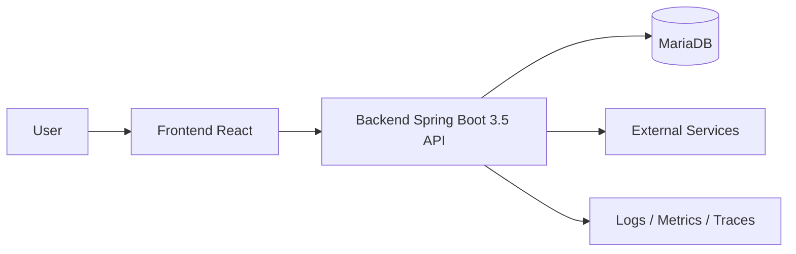

# Architecture Guideline

## Mục tiêu

Tài liệu này định nghĩa cách tổ chức hệ thống để team có chung một ngôn ngữ khi thiết kế, code review và mở rộng sản phẩm.

## Nguyên tắc chung

- Ưu tiên kiến trúc đơn giản, dễ test, dễ thay đổi.
- Tách biệt rõ business logic, infrastructure và presentation layer.
- Mọi thay đổi lớn cần giữ backward compatibility hoặc có kế hoạch migrate rõ ràng.
- Không để framework chi phối business rule.
- Logging, monitoring, security và testability là một phần của architecture, không phải việc làm sau.

## Tổng quan hệ thống



## Backend (Spring Boot 3.5 + Java 17 + Spring Batch)

### Kiến trúc bắt buộc

Backend bắt buộc sử dụng `modular architecture` làm hướng tổ chức chính. Mỗi module đại diện cho một nhóm nghiệp vụ rõ ràng và bên trong mỗi module bắt buộc áp dụng `layered architecture`.

Mục tiêu:

- Dễ mở rộng theo domain mà không làm codebase bị rối.
- Dễ phân chia ownership theo module khi team lớn dần.
- Hạn chế phụ thuộc chéo và tránh một package `common` phình to.
- Giữ business rule nằm gần nhau và dễ test độc lập.

Mỗi module bắt buộc gồm 4 layer chính:

- `api`: Controller, request/response DTO, validation, exception handler theo module.
- `application`: Use case, service điều phối nghiệp vụ, transaction boundary, facade cho module khác.
- `domain`: Entity nghiệp vụ, value object, business rule, domain service, repository contract.
- `infrastructure`: JPA repository implementation, external client, message broker, batch adapter, file storage.

### Cấu trúc package bắt buộc

```text
src/main/java/com/company/project
|- config
|- common
|- customer
|  |- api
|  |- application
|  |- domain
|  `- infrastructure
|- order
|  |- api
|  |- application
|  |- domain
|  `- infrastructure
`- batch
   |- api
   |- application
   |- domain
   `- infrastructure
```

Ở mức triển khai, mỗi module được tổ chức theo mẫu sau:

```text
com.company.project.order
|- api
|  |- OrderController.java
|  |- request
|  |- response
|  `- mapper
|- application
|  |- OrderApplicationService.java
|  |- command
|  |- query
|  `- facade
|- domain
|  |- model
|  |- service
|  |- repository
|  `- event
`- infrastructure
   |- persistence
   |- client
   |- messaging
   `- config
```

### Nguyên tắc phụ thuộc bắt buộc

Trong mỗi module, hướng phụ thuộc phải đi từ ngoài vào trong:

- `api` phụ thuộc `application`.
- `application` phụ thuộc `domain`.
- `infrastructure` phụ thuộc `domain` và được Spring wire vào `application`.
- `domain` không phụ thuộc `api` và không phụ thuộc framework.

Giữa các module, team phải tuân thủ:

- Module A không gọi trực tiếp vào `infrastructure` hoặc `domain internals` của module B.
- Điểm vào chuẩn để module khác sử dụng là `application facade` hoặc interface được expose rõ ràng.
- Nghiệp vụ bất đồng bộ phải đi qua event nội bộ hoặc message, không được tạo luồng gọi chéo nhiều tầng không kiểm soát.
- Không import DTO controller của module khác để tái sử dụng.

Ví dụ cách module `order` gọi sang module `customer`:

```text
com.company.project.customer
|- application
|  |- CustomerFacade.java
|  `- CustomerFacadeImpl.java
|- domain
|  |- model
|  `- repository
`- infrastructure
   `- persistence

com.company.project.order
`- application
   `- OrderApplicationService.java
```

`customer.application.CustomerFacade`

```java
public interface CustomerFacade {
    boolean existsActiveCustomer(Long customerId);
    CustomerSummary getCustomerSummary(Long customerId);
}
```

`customer.application.CustomerFacadeImpl`

```java
@Service
@RequiredArgsConstructor
class CustomerFacadeImpl implements CustomerFacade {

    private final CustomerRepository customerRepository;

    @Override
    public boolean existsActiveCustomer(Long customerId) {
        return customerRepository.existsActiveById(customerId);
    }

    @Override
    public CustomerSummary getCustomerSummary(Long customerId) {
        Customer customer = customerRepository.findById(customerId)
            .orElseThrow(() -> new IllegalArgumentException("Customer not found"));

        return new CustomerSummary(customer.getId(), customer.getCode(), customer.getFullName());
    }
}
```

`order.application.OrderApplicationService`

```java
@Service
@RequiredArgsConstructor
public class OrderApplicationService {

    private final CustomerFacade customerFacade;
    private final OrderRepository orderRepository;

    @Transactional
    public Long createOrder(CreateOrderCommand command) {
        if (!customerFacade.existsActiveCustomer(command.customerId())) {
            throw new IllegalArgumentException("Customer is not active");
        }

        CustomerSummary customer = customerFacade.getCustomerSummary(command.customerId());

        Order order = Order.create(customer.id(), command.items(), command.createdBy());
        orderRepository.save(order);

        return order.getId();
    }
}
```

Rule rút ra từ ví dụ trên:

- Module `order` được phép phụ thuộc vào `customer.application.CustomerFacade`.
- Module `order` không được gọi `customer.infrastructure` hoặc JPA repository của `customer`.
- Module `order` không được thao tác trực tiếp với entity nội bộ của `customer` nếu entity đó không được expose qua contract.
- Dữ liệu trao đổi giữa 2 module phải đi qua contract rõ ràng như `CustomerSummary`.

### Quy tắc thiết kế

- Controller chỉ tiếp nhận request, validate input, gọi application service và trả response.
- Application service chịu trách nhiệm orchestration, transaction, permission check và gọi các dependency cần thiết.
- Domain chứa business rule cốt lõi và phải test được mà không cần Spring context.
- Repository contract đặt trong `domain`, implementation đặt trong `infrastructure`.
- Tích hợp hệ thống ngoài thông qua adapter/client riêng, không gọi trực tiếp từ controller hoặc domain.
- Mapper giữa entity, DTO, view model phải đặt sát module và sát use case cần dùng.

### Quy trình tạo module

Module mới được tạo khi có một trong các dấu hiệu sau:

- Có nhóm nghiệp vụ riêng và có khả năng mở rộng độc lập.
- Có API, batch flow, rule nghiệp vụ riêng.
- Có khả năng được một nhóm người sở hữu lâu dài.

Khi tạo module mới, team phải thực hiện theo thứ tự sau:

1. Xác định tên module theo domain, ví dụ `customer`, `order`, `payment`, `import-job`.
2. Tạo 4 package `api`, `application`, `domain`, `infrastructure`.
3. Đặt use case vào `application` theo dạng `CreateOrderCommand`, `CreateOrderService`, `GetOrderQueryService`.
4. Đặt entity, value object, repository contract và business rule vào `domain`.
5. Đặt JPA repository, external client, scheduler, batch reader/writer vào `infrastructure`.
6. Chỉ expose những gì module khác cần thông qua `application facade`.

### Luồng xử lý request bắt buộc

Luồng xử lý chuẩn cho API:

1. `OrderController` nhận request và validate.
2. Controller map request thành command và gọi `OrderApplicationService`.
3. `OrderApplicationService` mở transaction, gọi domain service và repository contract.
4. `OrderRepositoryImpl` trong `infrastructure` làm việc với JPA/MariaDB.
5. Kết quả được map thành response và trả về cho client.

Những điều bị cấm:

- Controller gọi trực tiếp repository.
- Application service thao tác SQL hoặc JPA chi tiết.
- Domain object gọi HTTP client hoặc đọc file.

### Quy tắc Spring Batch (Update Later)

`Spring Batch` bắt buộc tuân theo modular architecture, không tạo một tầng batch tách rời khỏi domain.

Batch chỉ được tổ chức theo 1 trong 2 cách sau:

- Nếu batch thuộc rõ vào một domain, đặt batch trong module đó. Ví dụ `customer.infrastructure.batch`.
- Nếu batch điều phối nhiều module, tạo module riêng `batch` hoặc `job`, nhưng chỉ được gọi vào `application facade` của các module liên quan.

Cấu trúc batch chuẩn:

```text
com.company.project.batch
|- api
|  `- BatchJobController.java
|- application
|  |- CustomerSyncJobFacade.java
|  `- SettlementJobFacade.java
|- domain
|  `- BatchExecutionRule.java
`- infrastructure
   |- job
   |- step
   |- reader
   |- processor
   |- writer
   `- listener
```

Nguyên tắc bắt buộc cho batch:

- `reader`, `processor`, `writer` đặt ở `infrastructure`.
- Rule nghiệp vụ xử lý từng bản ghi phải đặt ở `domain` hoặc `application`, không đặt trong `reader`, `processor`, `writer` nếu đó là business rule.
- Job không truy cập trực tiếp module khác qua repository implementation.
- Job phải gọi `application facade` để tái sử dụng nghiệp vụ đã được chuẩn hóa khi batch và API cùng dùng một luồng xử lý.
- Retry, skip, chunk size, idempotency và logging phải được thiết kế rõ ngay từ đầu.

### Tiêu chuẩn kỹ thuật bắt buộc

- Backend phải sử dụng `Java 17`, `Spring Boot 3.5`, `Spring Web`, `Spring Validation`, `Spring Data JPA`, `Spring Batch`.
- Nếu hệ thống có auth, backend phải sử dụng `Spring Security` và có cơ chế JWT hoặc OAuth2 rõ ràng.
- Database chuẩn của hệ thống là `MariaDB`.
- Database là do khách hàng cung cấp; team dev không được thêm, sửa, xóa schema hoặc migration nếu chưa có phê duyệt chính thức từ owner của database.
- Tất cả config, trừ secret, phải được quản lý qua `application-*.yml` và environment variable.
- Hệ thống phải cung cấp `health`, `readiness`, `liveness` endpoint.
- Tất cả log liên quan request và batch phải có `traceId` hoặc `requestId`.
- Job batch phải tách rõ `job`, `step`, `reader`, `processor`, `writer` và có cơ chế retry / skip nếu nghiệp vụ yêu cầu.

### Biên giới module bắt buộc

- Shared utility chỉ được tạo khi đã có ít nhất 2 module cần dùng và phải thật sự generic.
- Không tạo `common` quá sớm và biến nó thành nơi chứa code vô chủ đề.
- Quan hệ giữa các module phải đi qua interface, event hoặc application facade rõ ràng.
- Mỗi module phải có ranh giới dữ liệu, nghiệp vụ và transaction rõ ràng.
- Nếu một module bắt đầu chứa quá nhiều use case không liên quan, team phải tách module.

### Testing strategy bắt buộc theo module

- `domain` test bằng unit test, không cần Spring context.
- `application` test bằng service test, mock repository contract và external port.
- `infrastructure` test bằng integration test với database MariaDB hoặc Testcontainers.
- `api` test bằng controller test cho validation, error format và contract chính.
- `batch` test riêng cho job, step và idempotency của từng luồng xử lý.

### Checklist review module

- Tên module có phản ánh đúng domain không.
- Đã đủ 4 layer `api`, `application`, `domain`, `infrastructure` chưa.
- `domain` có độc lập với framework không.
- Module có expose facade/interface rõ ràng cho module khác không.
- Có thành phần nào đang đi tắt qua repository hoặc infrastructure của module khác không.
- Batch job nếu có đã dùng lại application service hoặc domain rule đúng cách chưa.

## Frontend (React + Vite + TypeScript + Tailwind CSS)

### Kiến trúc bắt buộc

Frontend bắt buộc sử dụng `React`, `Vite`, `TypeScript` và `feature-based architecture`. Code frontend phải được tổ chức theo feature, tách rõ giao diện, state và API layer:

- `app`: bootstrap, app provider, app-level initialization.
- `pages`: page-level composition.
- `features`: use case theo nghiệp vụ.
- `components`: reusable UI component.
- `services`: API client, adapter, integration.
- `hooks`: custom hook tái sử dụng.
- `shared`: constant, util, type, design token dùng chung.

### Cấu trúc thư mục bắt buộc

```text
src
|- app
|- pages
|- features
|- components
|- services
|- hooks
|- shared
|- assets
|- config
|- routes
|- locales
`- layouts
```

Frontend phải được khởi tạo và build bằng `Vite`.

Frontend phải sử dụng `TypeScript` cho toàn bộ source code trong `src`. Không được tạo file mới bằng JavaScript thường trong codebase frontend, trừ các file config của tool nếu cần.

Type phải được đặt gần feature hoặc gần module đang sử dụng. Không được tạo một thư mục `types` dùng chung nếu không có ranh giới rõ ràng.

Ranh giới thư mục phải được hiểu như sau:

- `pages` chỉ được dùng để compose page, route-level layout và kết nối nhiều feature.
- `features` phải chứa đầy đủ UI, hook, service và type liên quan đến một use case nghiệp vụ.
- `components` chỉ được chứa reusable component dùng chung và không được chứa business logic theo domain.
- `shared` chỉ được chứa những thành phần thật sự generic như constant, util, base UI, token, type dùng chung.
- `services` chỉ được chứa API client dùng chung, interceptor, transport wrapper hoặc integration cấp ứng dụng.
- `hooks` chỉ được chứa custom hook dùng chung ở cấp ứng dụng; hook gắn nghiệp vụ phải đặt trong feature tương ứng.
- `config` chỉ được chứa cấu hình frontend cấp ứng dụng như env mapping, app setting, runtime config parser.
- `routes` chỉ được chứa khai báo route, route guard, route metadata và route composition cấp ứng dụng.
- `locales` chỉ được chứa resource phục vụ i18n như dictionary, translation file, locale config.
- `layouts` chỉ được chứa layout dùng ở cấp page hoặc cấp app, không chứa business logic theo feature.

### Quy tắc thiết kế bắt buộc

- Page chỉ làm nhiệm vụ compose, không xử lý logic.
- Business logic đưa vào custom hook hoặc service.
- API response cần được adapter thành model FE trước khi render.
- Component tái sử dụng phải giữ tính presentation-first và hạn chế phụ thuộc vào state toàn cục.
- State dữ liệu server và state UI phải được tách rõ.
- Component trong `features` không được import ngược vào `shared` hoặc `components`.
- Mỗi feature phải tự quản lý type, hook, service và component của chính nó trừ khi đã đủ điều kiện đưa lên `shared`.

### Performance và maintainability

- Frontend phải sử dụng `Vite` cho bootstrap, dev server và build.
- Sử dụng `Tailwind CSS` cho utility-first styling; component chung cần thống nhất token màu sắc, spacing và typography.
- Route lớn phải có lazy loading.
- Không để prop drilling kéo dài qua 2-3 tầng component nếu có thể tách bằng hook, context cục bộ hoặc composition.
- Các khu vực quan trọng của ứng dụng phải có error boundary.
- Loading state, empty state, error state, cache, refetch và optimistic update phải được thiết kế ngay từ đầu cho các màn hình có thao tác dữ liệu.

### Mẫu cấu trúc feature

```text
src/features/order-create
|- api
|  `- order-create.service.ts
|- components
|  |- order-create-form.tsx
|  `- order-item-table.tsx
|- hooks
|  `- use-order-create.ts
|- types
|  |- order-create-command.ts
|  `- order-create-view-model.ts
`- index.ts
```

Rule cho feature:

- Một feature phải đóng gói đầy đủ UI, hook, service và type liên quan đến use case đó.
- File `index.ts` chỉ được expose những thành phần cần cho `pages` hoặc feature khác sử dụng.
- Không được để page truy cập trực tiếp vào file nội bộ của feature nếu feature đã có điểm expose qua `index.ts`.

## Nguyên tắc hợp tác giữa BE và FE

- API contract được thống nhất trước khi code.
- DTO backend và view model frontend không bắt buộc giống nhau 1-1.
- Error format, pagination và auth flow phải thống nhất toàn hệ thống.
- Mọi thay đổi break contract phải có versioning hoặc rollout plan.

## Checklist review architecture

- Đã tách rõ presentation, business và data access chưa.
- Có điểm nào framework xâm lấn business rule không.
- Có module nào đang phụ thuộc hai chiều không.
- Có dễ test độc lập từng phần không.
- Logging, security, config và monitoring đã được tính ngay từ thiết kế chưa.
