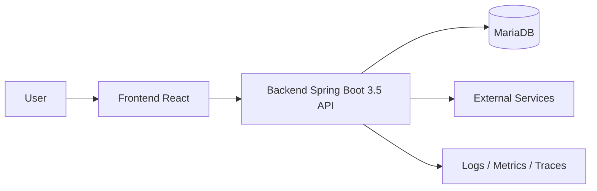

# Architecture Guideline

## Objective

This document defines how the system should be organized so the team shares a common language for design, code review, and product evolution.

## General Principles

- Prioritize architecture that is simple, testable, and easy to change.
- Clearly separate business logic, infrastructure, and presentation layers.
- Every major change must preserve backward compatibility or include a clear migration plan.
- Do not let frameworks dictate business rules.
- Logging, monitoring, security, and testability are part of the architecture, not afterthoughts.

## System Overview



## Backend (Spring Boot 3.5 + Java 17 + Spring Batch)

### Mandatory Architecture

The backend must use `modular architecture` as the primary organizational approach. Each module represents a clearly defined business area, and each module must apply `layered architecture` internally.

Objectives:

- Scale by domain without turning the codebase into a mess.
- Make ownership easier to split by module as the team grows.
- Limit cross-dependencies and avoid an oversized `common` package.
- Keep business rules close together and easy to test independently.

Each module must contain these 4 main layers:

- `api`: Controllers, request/response DTOs, validation, module-specific exception handlers.
- `application`: Use cases, business orchestration services, transaction boundaries, facades for other modules.
- `domain`: Business entities, value objects, business rules, domain services, repository contracts.
- `infrastructure`: JPA repository implementations, external clients, message brokers, batch adapters, file storage.

### Mandatory Package Structure

```text
src/main/java/com/company/project
|- config
|- common
|- customer
|  |- api
|  |- application
|  |- domain
|  `- infrastructure
|- order
|  |- api
|  |- application
|  |- domain
|  `- infrastructure
`- batch
   |- api
   |- application
   |- domain
   `- infrastructure
```

At the implementation level, each module should follow this structure:

```text
com.company.project.order
|- api
|  |- OrderController.java
|  |- request
|  |- response
|  `- mapper
|- application
|  |- OrderApplicationService.java
|  |- command
|  |- query
|  `- facade
|- domain
|  |- model
|  |- service
|  |- repository
|  `- event
`- infrastructure
   |- persistence
   |- client
   |- messaging
   `- config
```

### Mandatory Dependency Rules

Inside each module, dependencies must point inward:

- `api` depends on `application`.
- `application` depends on `domain`.
- `infrastructure` depends on `domain` and is wired into `application` by Spring.
- `domain` must not depend on `api` and must not depend on frameworks.

Between modules, the team must follow these rules:

- Module A must not call `infrastructure` or `domain internals` of module B directly.
- The standard entry point for other modules is the `application facade` or another explicitly exposed interface.
- Asynchronous business flows must go through internal events or messages; do not create uncontrolled multi-layer cross-calls.
- Do not import another module's controller DTOs for reuse.

Example of how module `order` calls module `customer`:

```text
com.company.project.customer
|- application
|  |- CustomerFacade.java
|  `- CustomerFacadeImpl.java
|- domain
|  |- model
|  `- repository
`- infrastructure
   `- persistence

com.company.project.order
`- application
   `- OrderApplicationService.java
```

`customer.application.CustomerFacade`

```java
public interface CustomerFacade {
    boolean existsActiveCustomer(Long customerId);
    CustomerSummary getCustomerSummary(Long customerId);
}
```

`customer.application.CustomerFacadeImpl`

```java
@Service
@RequiredArgsConstructor
class CustomerFacadeImpl implements CustomerFacade {

    private final CustomerRepository customerRepository;

    @Override
    public boolean existsActiveCustomer(Long customerId) {
        return customerRepository.existsActiveById(customerId);
    }

    @Override
    public CustomerSummary getCustomerSummary(Long customerId) {
        Customer customer = customerRepository.findById(customerId)
            .orElseThrow(() -> new IllegalArgumentException("Customer not found"));

        return new CustomerSummary(customer.getId(), customer.getCode(), customer.getFullName());
    }
}
```

`order.application.OrderApplicationService`

```java
@Service
@RequiredArgsConstructor
public class OrderApplicationService {

    private final CustomerFacade customerFacade;
    private final OrderRepository orderRepository;

    @Transactional
    public Long createOrder(CreateOrderCommand command) {
        if (!customerFacade.existsActiveCustomer(command.customerId())) {
            throw new IllegalArgumentException("Customer is not active");
        }

        CustomerSummary customer = customerFacade.getCustomerSummary(command.customerId());

        Order order = Order.create(customer.id(), command.items(), command.createdBy());
        orderRepository.save(order);

        return order.getId();
    }
}
```

Rules illustrated by the example above:

- Module `order` may depend on `customer.application.CustomerFacade`.
- Module `order` must not call `customer.infrastructure` or the `customer` JPA repository directly.
- Module `order` must not manipulate `customer` internal entities directly unless those entities are exposed through a contract.
- Data exchanged between the two modules must go through a clear contract such as `CustomerSummary`.

### Design Rules

- Controllers only receive requests, validate input, call application services, and return responses.
- Application services are responsible for orchestration, transactions, permission checks, and invoking required dependencies.
- The domain contains core business rules and must be testable without a Spring context.
- Repository contracts belong in `domain`; implementations belong in `infrastructure`.
- External system integrations must go through dedicated adapters/clients, not directly from controllers or the domain.
- Mappers between entities, DTOs, and view models must stay close to the module and the use case that needs them.

### Module Creation Process

A new module should be created when at least one of these signals exists:

- It has its own business area and can evolve independently.
- It has its own API, batch flow, or business rules.
- It is likely to have long-term ownership by a specific group.

When creating a new module, the team must follow this order:

1. Define the module name by domain, for example `customer`, `order`, `payment`, `import-job`.
2. Create the 4 packages `api`, `application`, `domain`, `infrastructure`.
3. Place use cases in `application` using names such as `CreateOrderCommand`, `CreateOrderService`, `GetOrderQueryService`.
4. Place entities, value objects, repository contracts, and business rules in `domain`.
5. Place JPA repositories, external clients, schedulers, and batch readers/writers in `infrastructure`.
6. Expose only what other modules need through an `application facade`.

### Mandatory Request Processing Flow

Standard API flow:

1. `OrderController` receives the request and validates it.
2. The controller maps the request to a command and calls `OrderApplicationService`.
3. `OrderApplicationService` opens a transaction and calls domain services and repository contracts.
4. `OrderRepositoryImpl` in `infrastructure` works with JPA/MariaDB.
5. The result is mapped to a response and returned to the client.

The following are prohibited:

- A controller calling a repository directly.
- An application service manipulating SQL or JPA details directly.
- A domain object calling an HTTP client or reading files.

### Spring Batch Rules (Update Later)

`Spring Batch` must follow modular architecture and must not become a separate batch layer disconnected from the domain.

Batch code may only be organized in one of these two ways:

- If the batch job clearly belongs to a domain, place it in that module. Example: `customer.infrastructure.batch`.
- If the batch job coordinates multiple modules, create a dedicated `batch` or `job` module, but it may only call the `application facade` of the related modules.

Standard batch structure:

```text
com.company.project.batch
|- api
|  `- BatchJobController.java
|- application
|  |- CustomerSyncJobFacade.java
|  `- SettlementJobFacade.java
|- domain
|  `- BatchExecutionRule.java
`- infrastructure
   |- job
   |- step
   |- reader
   |- processor
   `- writer
```
