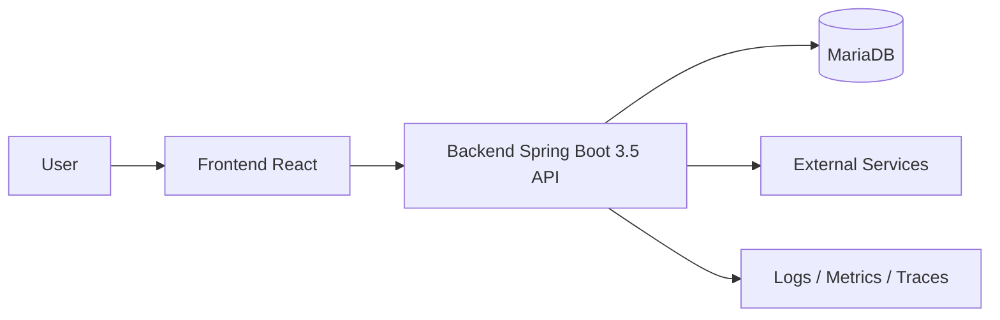

# Architecture Guideline

## Objective

This document defines how the system should be organized so the team shares a common language for design, code review, and product evolution.

## General Principles

- Prioritize architecture that is simple, testable, and easy to change.
- Clearly separate business logic, infrastructure, and presentation layers.
- Every major change must preserve backward compatibility or include a clear migration plan.
- Do not let frameworks dictate business rules.
- Logging, monitoring, security, and testability are part of the architecture, not afterthoughts.

## System Overview



## Backend (Spring Boot 3.5 + Java 17 + Spring Batch)

### Mandatory Architecture

The backend must use `modular architecture` as the primary organizational approach. Each module represents a clearly defined business area, and each module must apply `layered architecture` internally.

Objectives:

- Scale by domain without turning the codebase into a mess.
- Make ownership easier to split by module as the team grows.
- Limit cross-dependencies and avoid an oversized `common` package.
- Keep business rules close together and easy to test independently.

Each module must contain these 4 main layers:

- `api`: Controllers, request/response DTOs, validation, module-specific exception handlers.
- `application`: Use cases, business orchestration services, transaction boundaries, facades for other modules.
- `domain`: Business entities, value objects, business rules, domain services, repository contracts.
- `infrastructure`: JPA repository implementations, external clients, message brokers, batch adapters, file storage.

### Mandatory Package Structure

```text
src/main/java/com/company/project
|- config
|- common
|- customer
|  |- api
|  |- application
|  |- domain
|  `- infrastructure
|- order
|  |- api
|  |- application
|  |- domain
|  `- infrastructure
`- batch
   |- api
   |- application
   |- domain
   `- infrastructure
```

At the implementation level, each module should follow this structure:

```text
com.company.project.order
|- api
|  |- OrderController.java
|  |- request
|  |- response
|  `- mapper
|- application
|  |- OrderApplicationService.java
|  |- command
|  |- query
|  `- facade
|- domain
|  |- model
|  |- service
|  |- repository
|  `- event
`- infrastructure
   |- persistence
   |- client
   |- messaging
   `- config
```

### Mandatory Dependency Rules

Inside each module, dependencies must point inward:

- `api` depends on `application`.
- `application` depends on `domain`.
- `infrastructure` depends on `domain` and is wired into `application` by Spring.
- `domain` must not depend on `api` and must not depend on frameworks.

Between modules, the team must follow these rules:

- Module A must not call `infrastructure` or `domain internals` of module B directly.
- The standard entry point for other modules is the `application facade` or another explicitly exposed interface.
- Asynchronous business flows must go through internal events or messages; do not create uncontrolled multi-layer cross-calls.
- Do not import another module's controller DTOs for reuse.

Example of how module `order` calls module `customer`:

```text
com.company.project.customer
|- application
|  |- CustomerFacade.java
|  `- CustomerFacadeImpl.java
|- domain
|  |- model
|  `- repository
`- infrastructure
   `- persistence

com.company.project.order
`- application
   `- OrderApplicationService.java
```

`customer.application.CustomerFacade`

```java
public interface CustomerFacade {
    boolean existsActiveCustomer(Long customerId);
    CustomerSummary getCustomerSummary(Long customerId);
}
```

`customer.application.CustomerFacadeImpl`

```java
@Service
@RequiredArgsConstructor
class CustomerFacadeImpl implements CustomerFacade {

    private final CustomerRepository customerRepository;

    @Override
    public boolean existsActiveCustomer(Long customerId) {
        return customerRepository.existsActiveById(customerId);
    }

    @Override
    public CustomerSummary getCustomerSummary(Long customerId) {
        Customer customer = customerRepository.findById(customerId)
            .orElseThrow(() -> new IllegalArgumentException("Customer not found"));

        return new CustomerSummary(customer.getId(), customer.getCode(), customer.getFullName());
    }
}
```

`order.application.OrderApplicationService`

```java
@Service
@RequiredArgsConstructor
public class OrderApplicationService {

    private final CustomerFacade customerFacade;
    private final OrderRepository orderRepository;

    @Transactional
    public Long createOrder(CreateOrderCommand command) {
        if (!customerFacade.existsActiveCustomer(command.customerId())) {
            throw new IllegalArgumentException("Customer is not active");
        }

        CustomerSummary customer = customerFacade.getCustomerSummary(command.customerId());

        Order order = Order.create(customer.id(), command.items(), command.createdBy());
        orderRepository.save(order);

        return order.getId();
    }
}
```

Rules illustrated by the example above:

- Module `order` may depend on `customer.application.CustomerFacade`.
- Module `order` must not call `customer.infrastructure` or the `customer` JPA repository directly.
- Module `order` must not manipulate `customer` internal entities directly unless those entities are exposed through a contract.
- Data exchanged between the two modules must go through a clear contract such as `CustomerSummary`.

### Design Rules

- Controllers only receive requests, validate input, call application services, and return responses.
- Application services are responsible for orchestration, transactions, permission checks, and invoking required dependencies.
- The domain contains core business rules and must be testable without a Spring context.
- Repository contracts belong in `domain`; implementations belong in `infrastructure`.
- External system integrations must go through dedicated adapters/clients, not directly from controllers or the domain.
- Mappers between entities, DTOs, and view models must stay close to the module and the use case that needs them.

### Module Creation Process

A new module should be created when at least one of these signals exists:

- It has its own business area and can evolve independently.
- It has its own API, batch flow, or business rules.
- It is likely to have long-term ownership by a specific group.

When creating a new module, the team must follow this order:

1. Define the module name by domain, for example `customer`, `order`, `payment`, `import-job`.
2. Create the 4 packages `api`, `application`, `domain`, `infrastructure`.
3. Place use cases in `application` using names such as `CreateOrderCommand`, `CreateOrderService`, `GetOrderQueryService`.
4. Place entities, value objects, repository contracts, and business rules in `domain`.
5. Place JPA repositories, external clients, schedulers, and batch readers/writers in `infrastructure`.
6. Expose only what other modules need through an `application facade`.

### Mandatory Request Processing Flow

Standard API flow:

1. `OrderController` receives the request and validates it.
2. The controller maps the request to a command and calls `OrderApplicationService`.
3. `OrderApplicationService` opens a transaction and calls domain services and repository contracts.
4. `OrderRepositoryImpl` in `infrastructure` works with JPA/MariaDB.
5. The result is mapped to a response and returned to the client.

The following are prohibited:

- A controller calling a repository directly.
- An application service manipulating SQL or JPA details directly.
- A domain object calling an HTTP client or reading files.

### Spring Batch Rules (Update Later)

`Spring Batch` must follow modular architecture and must not become a separate batch layer disconnected from the domain.

Batch code may only be organized in one of these two ways:

- If the batch job clearly belongs to a domain, place it in that module. Example: `customer.infrastructure.batch`.
- If the batch job coordinates multiple modules, create a dedicated `batch` or `job` module, but it may only call the `application facade` of the related modules.

Standard batch structure:

```text
com.company.project.batch
|- api
|  `- BatchJobController.java
|- application
|  |- CustomerSyncJobFacade.java
|  `- SettlementJobFacade.java
|- domain
|  `- BatchExecutionRule.java
`- infrastructure
   |- job
   |- step
   |- reader
   |- processor
   `- writer
```

- All configuration except secrets must be managed through `application-*.yml` and environment variables.
- The system must expose `health`, `readiness`, and `liveness` endpoints.
- All logs related to requests and batch jobs must include `traceId` or `requestId`.
- Batch jobs must clearly separate `job`, `step`, `reader`, `processor`, and `writer`, and include retry / skip mechanisms when the business flow requires them.

### Mandatory Module Boundaries

- Shared utilities may only be created when at least 2 modules truly need them and the utilities are genuinely generic.
- Do not create `common` too early and turn it into a place for ownerless code.
- Relationships between modules must go through clear interfaces, events, or application facades.
- Every module must have clear data, business, and transaction boundaries.
- If a module starts containing too many unrelated use cases, the team must split the module.

### Mandatory Testing Strategy by Module

- `domain` must be tested with unit tests and should not require a Spring context.
- `application` must be tested with service tests using mocked repository contracts and external ports.
- `infrastructure` must be tested with integration tests against MariaDB or Testcontainers.
- `api` must be tested with controller tests for validation, error format, and key contracts.
- `batch` must have dedicated tests for jobs, steps, and idempotency of each processing flow.

### Module Review Checklist

- Does the module name correctly reflect the domain?
- Are all 4 layers `api`, `application`, `domain`, and `infrastructure` present?
- Is `domain` independent from frameworks?
- Does the module expose a clear facade/interface for other modules?
- Is anything bypassing boundaries to access another module's repository or infrastructure directly?
- If a batch job exists, does it correctly reuse application services or domain rules?

## Frontend (React + Vite 8.x + TypeScript + Tailwind CSS)

### Mandatory Architecture

The frontend must use `React`, `Vite 8.x`, `TypeScript`, and `feature-based architecture`. Frontend code must be organized by feature and must clearly separate presentation, state, and API layers:

- `app`: bootstrap, app providers, app-level initialization.
- `pages`: page-level composition.
- `features`: business use cases.
- `components`: reusable UI components.
- `services`: API clients, adapters, integrations.
- `hooks`: reusable custom hooks.
- `shared`: shared constants, utilities, types, design tokens.

### Mandatory Folder Structure

```text
src
|- app
|- pages
|- features
|- components
|- services
|- hooks
|- shared
|- assets
|- config
|- routes
|- locales
`- layouts
```

The frontend must be bootstrapped and built with `Vite 8.x`.

The frontend must use `TypeScript` for all source code inside `src`. New plain JavaScript files must not be added to the frontend codebase, except tool configuration files when necessary.

Types must be placed close to the feature or module that uses them. Do not create a shared `types` folder unless there is a clear boundary and ownership model for it.

Folder boundaries must be understood as follows:

- `pages` may only compose pages, route-level layouts, and multiple features.
- `features` must contain the UI, hooks, services, and types related to a business use case.
- `components` may only contain reusable shared components and must not contain domain-specific business logic.
- `shared` may only contain truly generic pieces such as constants, utilities, base UI, tokens, and shared types.
- `services` may only contain shared API clients, interceptors, transport wrappers, or app-level integrations.
- `hooks` may only contain reusable app-level custom hooks; business-specific hooks must live in the relevant feature.
- `config` may only contain app-level frontend configuration such as env mapping, app settings, and runtime config parsers.
- `routes` may only contain route declarations, route guards, route metadata, and app-level route composition.
- `locales` may only contain i18n resources such as dictionaries, translation files, and locale configuration.
- `layouts` may only contain page-level or app-level layouts and must not contain feature business logic.

### Mandatory Design Rules

- Pages are only responsible for composition and must not contain business logic.
- Business logic must be moved into custom hooks or services.
- API responses must be adapted into FE models before rendering.
- Reusable components must remain presentation-first and should minimize dependence on global state.
- Server data state and UI state must be clearly separated.
- Components inside `features` must not be imported back into `shared` or `components`.
- Each feature must manage its own types, hooks, services, and components unless they clearly qualify to move into `shared`.

### Performance and Maintainability

- The frontend must use `Vite 8.x` for bootstrap, the dev server, and build.
- Use `Tailwind CSS` for utility-first styling; shared components must use consistent color, spacing, and typography tokens.
- Large routes must use lazy loading.
- Avoid prop drilling across more than 2-3 component levels when a hook, local context, or composition can express the structure better.
- Critical application areas must have error boundaries.
- Loading states, empty states, error states, cache behavior, refetch behavior, and optimistic updates must be designed from the beginning for data-driven screens.

### Example Feature Structure

```text
src/features/order-create
|- api
|  `- order-create.service.ts
|- components
|  |- order-create-form.tsx
|  `- order-item-table.tsx
|- hooks
|  `- use-order-create.ts
|- types
|  |- order-create-command.ts
|  `- order-create-view-model.ts
`- index.ts
```

Feature rules:

- A feature must encapsulate the UI, hooks, services, and types related to that use case.
- `index.ts` may only expose the parts needed by `pages` or other features.
- Pages must not access internal feature files directly if the feature already exposes them through `index.ts`.

## BE and FE Collaboration Principles

- The API contract must be agreed before implementation starts.
- Backend DTOs and frontend view models do not have to match 1:1.
- Error format, pagination, and auth flow must be consistent across the whole system.
- Any breaking contract change must include versioning or a rollout plan.

## Architecture Review Checklist

- Are presentation, business, and data access clearly separated?
- Is any framework leaking into business rules?
- Does any module have circular dependencies?
- Can each part be tested independently?
- Were logging, security, configuration, and monitoring considered from the design stage?
